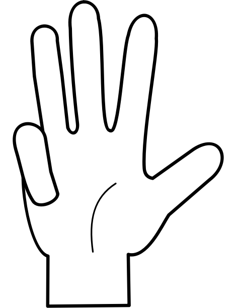

Consider the following:

| Hand              | Value |
| ----------------- | ----- |
|   | 0     |
|    | 1     |
|    | 2     |
|  | 3     |
|   | 4     |
|   | 5     |
|    | 6     |
|  | 7     |
|  | 8     |
|   | 9     |

If each hand represents a digit in base $10$, then two hands can express anywhere from $0$ to $99$.
