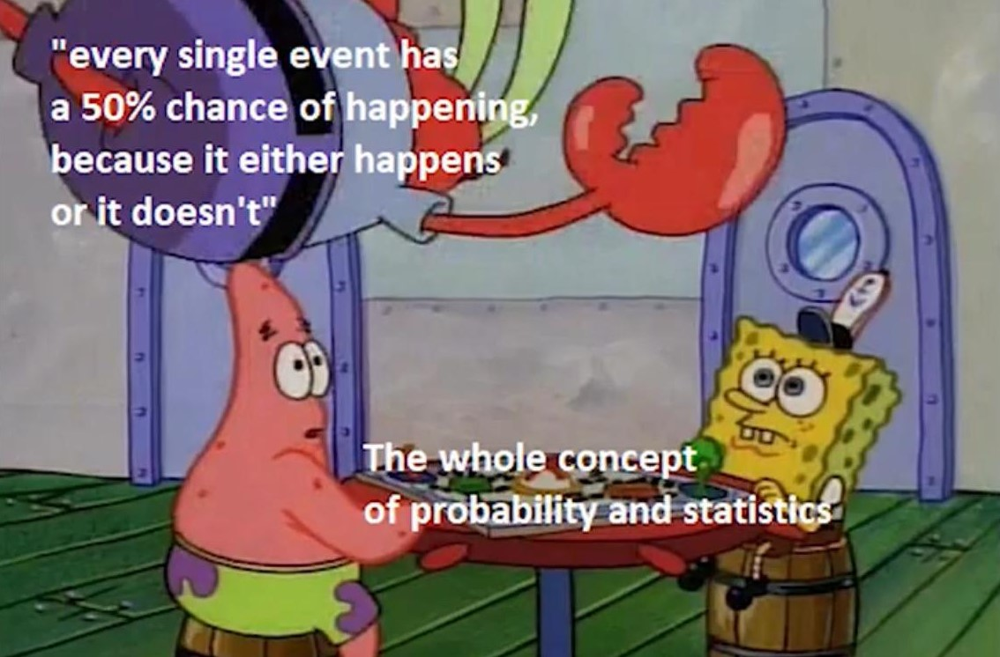
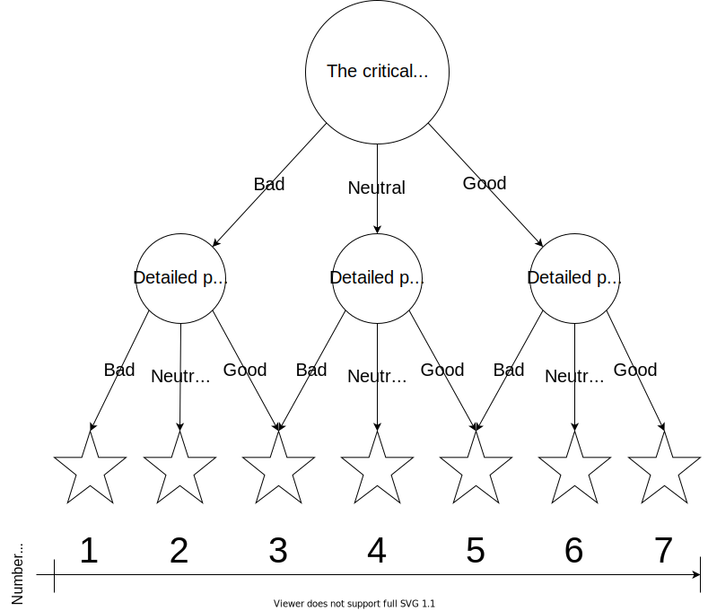

The human brain is not very good at conceptualizing large numbers and complicated proportions. For example, can you really imagine a $3\%$ chance of winning? Chances are (no pun intended) that you can't. Most people see "$3\%$ chance" and internally translate it to "close to not happening". Likewise, we see $98\%$ and think "close to certain". And when we see something like $42\%$, we think "it can either happen or not". This meme captures this idea:

A similar problem occurs with 10-Star rating scales. In too many cases are there inconsistencies in even just one reviewer; that is, among the subjects that they rate $7/10$ and $8/10$, for example, there are some $7/10$ subjects that they prefer over $8/10$. This makes the difference between $7/10$ and $8/10$ meaningless, and adds skepticism towards the difference between $6/10$ and $7/10$, and $8/10$ and $9/10$ ratings.

## Making the Stars Matter

Here is the elegant solution: put a tangible, human association to each ranking. We established that we are capable of clearly distinguishing $3$ tiers: **nothing**, **everything**, and **about halfway**. This seems to inspire a 3-Star rating system, but clearly, there isn't enough granularity; most things would fall into the $2/3$ category, as $3/3$ is reserved for subjects without any flaws and $1/3$ is reserved for subjects with only flaws.

Sidenote:   I am not allowing a $0/x$ rating because many review systems and websites require a minimum of $1$ star. This is to ensure that a reviewer _really_ meant to mark a subject as the lowest tier, instead of simply forgetting to star an item.

This is where a tree-like system comes in handy. At the first level, we rate a subject as either **generally bad**, **generally good**, or **generally neutral**. Then, we adjust the rating based on whether it is closer to the general tier below or above it. For example, I rate tangerines (as an enjoyable snack) as **generally good** due to its tasty nature, but since occasional seeds are unexpected and uninvited and its acidity makes it hard to eat many without getting sick, the details of a tangerine are mostly bad, resulting in a rating of $5/7$.

Notice that some arrows end up on the same star. This is because generally, a subject with critical parts that are generally good and detailed parts that are mostly bad is about the same as a subject with critical parts that are neutral and detailed parts that are mostly good.

## Cons

* This doesn't solve the problem of how $x/y$ stars have a different meaning across different people.
* The tree-like structure may turn away some people due to its "apparent complexity".
* $7$ is prime

## Pros

* This does solve the problem of inconsistency within one reviewer. Now, a ranking by a person is necessarily better than other rankings that are lower and necessarily worse than other rankings that are higher by the same person.
* Once understood, it's not complicated
* $7$ is not used for ranking at all, so it can be understood to have this tree-like structure.